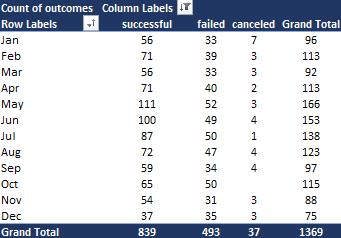
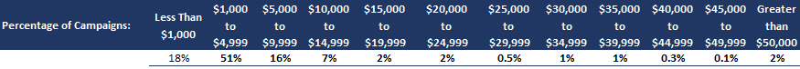
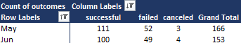
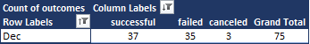
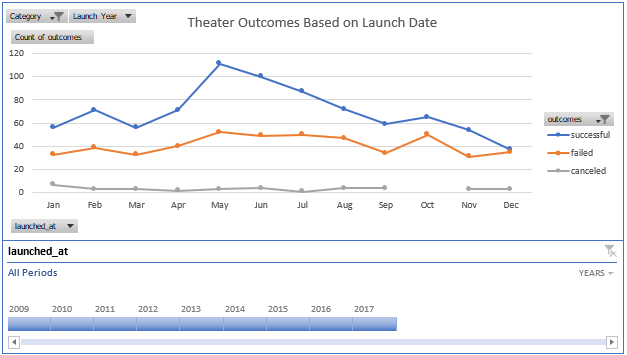
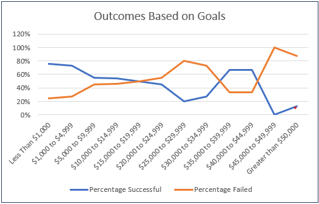
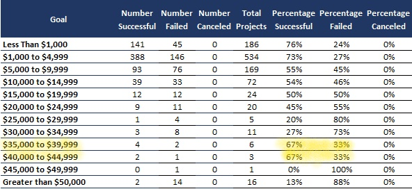
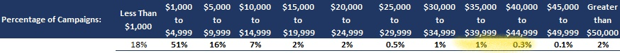

# An Analysis of Kickstarter Campaigns

## Overview of Project: 
The purpose of this analysis of Kickstarted data is to look for trends between how fundraising campaigns fared in relation to their launch dates and funding goals. I will attempt to draw some conclusions for how one specific data subset – fundraising campaigns for plays – to provide some insight into how to maximize the chances of success for a new fundraising campaign in this same sub-category on the Kickstarter platform.  

## Analysis and Challenges
I began my analysis by determining the two factors that I would use to try show a relationship between it and a campaign’s success. The first factor was the launch date of the campaign, or when was the campaign posted to the Kickstarter platform. The second factor was the fundraising goal of the campaign, or how much money the campaign was trying to generate. These two factors are helpful because they can help establish clear guidelines for prospective campaigns for plays on Kickstarter when it comes to the most basic campaign considerations – how much to ask for and when to ask for it. 

To start looking for relationships with the launch date data, I first had to decide how I would break down the dates – by individual dates, by years, by quarters, etc. I decided to categorize the data by month, but with the ability to break out individual years if needs be. I chose to not try to plot individual data points because of the number of dates that I had (1,369) even when filtering just for theater fundraiser data. Creating bins for each month would illustrate helpful historical trends, while not overwhelming the viewer with too many data points. 

When analyzing the data set for fundraising goal, the question of how to categorize and create “bins” for the data was even more important given the range of values in the data set. I was only looking at the data sub-category of plays, but I still had 1,066 data points, with a value range of $1.00 to $200,000.00. Despite the large range of the data, the majority of the data points were concentrated on the lower end of the range at $10,000.00 or under. To be inclusive of the range of the data and still give some helpful bins for the data points under $10,000.00, I created twelve bins, the first of which captured all data points under $1,000.00, and the last of which captured all data points above $50,000.00, with the remainder falling into incremented bins of $5,000.00 from $0 to $50,000.00. I believe that this shows the spread of the data, while still giving helpful information regarding the success or failure of the campaigns within those funding goal ranges.

## Results: 
### Analysis of Outcomes Based on Launch Dates:
In looking at trends on the graph for theater outcomes based on launch dates, it is clear that there are points where there is a notable increase between the number of successful and failed campaigns, and also that there is a point where there is a notable decrease between the number of successful and failed campaigns. In May and June, the number of successful campaigns is over two times the number of failed campaigns, higher than at any other point. 

Conversely, in December, the number of successful and failed campaigns are almost the same, with only a two-campaign difference between the two numbers. 

Two conclusions can be made here: first, that launching a campaign during May and June historically give the greatest changes of the campaign succeeding, and second, that launching a campaign in December gives the lowest chance of the campaign succeeding.

### Analysis of Outcomes Based on Goals:
When looking for conclusions in outcomes based on goals, the initial trend in the data shows that the less money the campaigns for plays look to raise, the more likely they are to be successful. 

There are outliers on the graph for the $35,000 to $39,999 and $40,000 to $44,999 categories, but these two categories only account for 1.3% of the data set combined. 

  

I do not think that statistically this is enough to offset the overall trend. 

### Limiting Factors and Recommendations:
Looking at trends in outcomes as they relate to timing and campaign goal amount give good general outlines for successful campaign creation. Other general campaign statistics that might be helpful to analyze are campaign duration, and whether being a “staff pick” changed any of the outcomes for a campaign in any of these breakdowns. Additionally, it might be helpful to do a deeper dive into where successful campaigns’ funding came from – whether more donors giving less money, or fewer, but more specifically driven donors giving more money? One could also look at the length of blurbs and whether having more information was helpful or hurtful to a campaign. These are, however, only the quantitative attributes to a Kickstarter campaign. There are many qualitative factors, such as how well-written blurbs and descriptions are, whether a campaign had good incentives to donate, and how the campaign was advertised that are not possible to measure with this data set, but would be helpful to factor in to the probability of success or failure of a campaign.

## Conclusions:
In conclusion, if you are creating a Kickstarter campaign to raise money for producing a play, you will have a higher likelihood of success if you can keep your fundraising goal to under $10,000 and launch your campaign in the summer months of May or June, however there may be other factors at play that could help or hinder your campaign’s success. 

