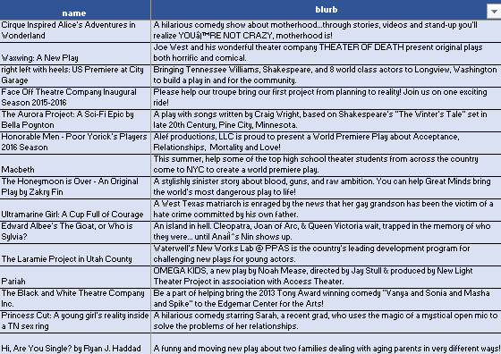
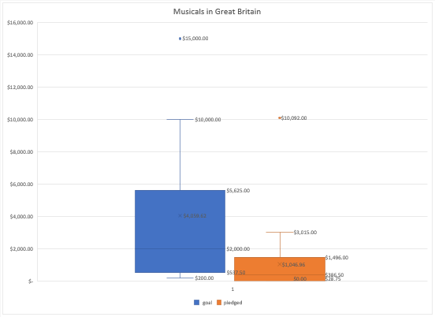

# An Analysis of Kickstarter Campaigns
This is an analysis of Kickstarter funding for theater productions in the US to gauge the potential success of the campaign for the new play "Fever" with a fundraising goal of $10,000.00

To complete this analysis, I looked at the data of 4,114 different Kickstarter campaigns. Of those 4,114, 671 were campaigns to fund theater productions in the US. 
While theater campaigns make up a small percentage of the total campaigns on Kickstarter, they generally do very well. 
61% of the campaigns to fund play productions in the US were successful. The average rate of success for Kickstarter campaigns is 53%, so theater can be considered a popular category for funding by Kickstarter's donors in the US.

Breaking down which campaigns were funded is a helpful tool in determining what makes a Kickstarter campaign successful. 
Successful kickstarter campaigns to fund plays had an average goal of  $5,048.88, as opposed to the much larger average goal of  $10,554.21 for failed campaigns.
While this may seem to indicate that successful campaigns had lower funding goals, it should be noted that the average amounts pledged differed by a factor of 10 between failed and successful campaigns. 

This indicates that there may be other reasons for the campaigns' failure than the fact that the funding goal was higher. 
The successful US theater campaigns had an average of 63 backers, each making an average donation of $93.00 per person.
Failed campaigns only had an average of 8 donors to their campaigns, and excluding campaigns that had no donors and raised $0.00, the average per person donation for failed campaigns was only $58.00.
This means that the successful campaigns somehow attracted more donors and incentivized the donors to give additional funds. 

There may be helpful factors in determining this success. For example, successful campaigns and failed campaigns had similar durations, but more campaigns failed near December, and more campaigns were successful in near May.

While there may be a boon to running the fundraising campaign for "Fever" in May, I would suggest that the higher donation amount and higher donor numbers for successful projects is due mostly to blurbs and incentives.

I have highlighted fifteen campaigns in the "Successful US Kickstarters" tab that have the same fundraising goal as "Fever" so you can see the blurbs the authors included. My recommendation would be to run your campaign in the summer months and model your campaign and donor incentives off of the similar successful campaigns from previous years. 

Finally, there was the question of producing a musical in Great Britain with a budget of £4,000.00. Unfortunately, the odds of this hypothetical project getting funded are not as good as those for "Fever." Only 38% of similar campaigns were successfully funded through Kickstarter, with the average amount raised for each successful campaign just over £1,000.00. I believe this is due to lack of interest from donors, as successful campaigns for musicals in Great Britain only got an average of 27 donors per campaign. I would suggest either adjusting your budget or pursuing a different method of raising capital to produce a musical in England.

